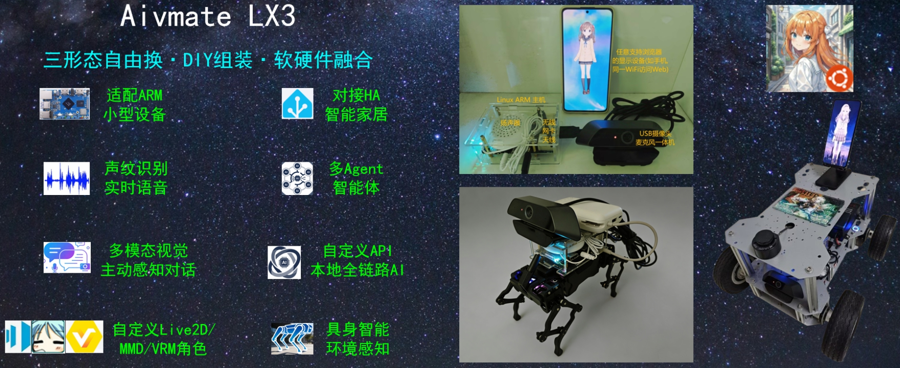
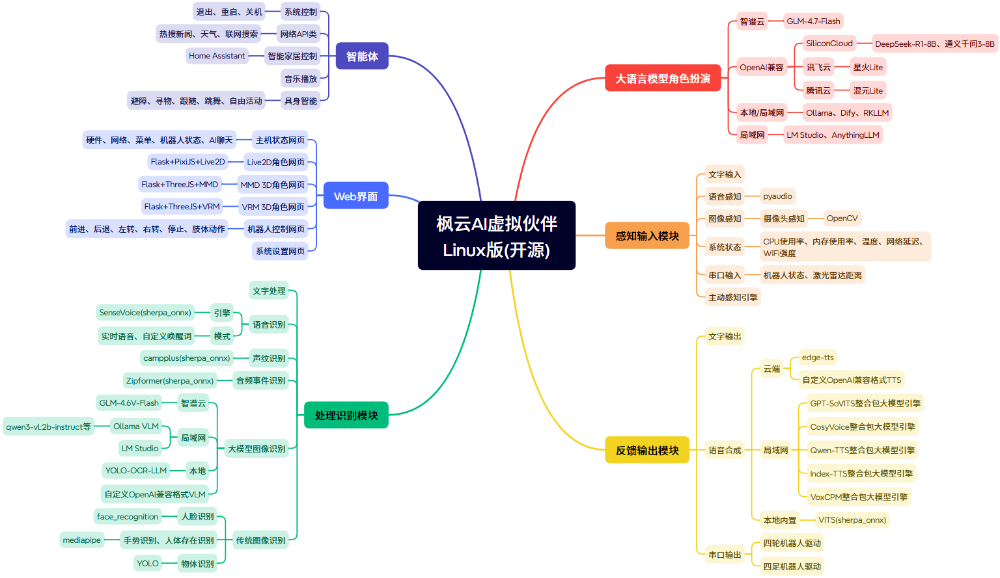

# 枫云AI虚拟伙伴Linux版

  

**枫云AI虚拟伙伴Linux版v3.0**(Aivmate LX3)是一款由MewCo-AI团队开源的支持迷你小盒子/四轮机器人/四足机器人三形态的AI伙伴，旨在为Linux用户打造一个功能丰富、高度可定制的虚拟伙伴。通过整合多种人工智能技术，实现声纹识别语音交互、多模态图像识别、多Agent智能体、Live2D/MMD 3D/VRM 3D角色展示、主动感知对话、机器人控制等功能。


## 功能特性

- **适配ARM小型设备**：可在香橙派、树莓派、Orin等Linux ARM小型设备上运行，便于随身携带；也支持在VMware X86虚拟机上运行。
- **广泛的开源AI生态**：对接多种云端/局域网/本地大语言模型、多模态模型、语音合成大模型，兼容OpenAI标准API。
- **声纹识别语音交互**：通过SenseVoice本地ASR引擎实现实时语音识别，还支持3D-Speaker声纹识别和Audio Tagging音频事件检测。
- **多模态图像识别**：支持摄像头内容的多模态图像理解问答、人脸识别、手势识别和物体检测。
- **本地知识库**：对接局域网AnythingLLM、局域网/本地Dify聊天助手提升虚拟伙伴的理解与回应精度。
- **多设备全平台访问**：在Linux主机上运行后，局域网内的设备(如电脑、手机、平板)可通过浏览器展示虚拟伙伴。
- **多Agent智能体**：支持联网搜索、新闻查询、天气查询、Home Assistant智能家居控制等智能体，可自定义扩展function.py实现更多功能。
- **主动感知引擎**：虚拟伙伴可主动发起对话，基于时间、天气、新闻、摄像头画面等内容选择话题。
- **机器人运动控制**：支持四轮机器人(ugv)和四足机器人(quad)控制，包括底盘运动、自动避障、自由活动、自动寻物、自动跟随、手势控制、肢体动作。
- **丰富的虚拟形象**：支持Live2D、MMD 3D、VRM 3D三种类型的虚拟角色展示，具有口型同步和肢体动画。
- **智能记忆管理**：支持对话历史记忆，可自动优化存储，避免内存溢出。



### **v3新版功能升级**

- **双机器人平台支持**：新增四足机器人控制，与原有四轮机器人形成更完整的具身智能方案
- **VRM 3D角色展示**：新增基于Three.js和VRM标准的3D角色展示，支持更丰富的互动动画
- **音频事件检测**：新增音频事件检测功能，可识别环境音效如口哨声、动物叫声等
- **流式语音合成**：支持TTS分段处理，提升长文本语音合成的流畅度
- **Web控制界面**：为两种机器人分别提供专业的Web控制面板

### 大语言模型角色扮演

1. **智谱云**
    - 支持GLM-4.7-Flash等模型。
2. **OpenAI兼容**（以下仅列举免费模型，可自由寻找其他模型）
    - **SiliconCloud**：支持DeepSeek-R1-8B、通义千问3-8B等模型。
    - **腾讯云**：支持混元Lite等模型。
    - **讯飞云**：支持星火Lite等模型。
3. **本地/局域网**
    - **Ollama**：在本地部署和使用模型，无网环境畅玩。
    - **Dify**：支持本地知识库，实现更优角色扮演聊天。
    - **RKLLM**：对接RKLLM整合包服务器，支持调用RK3588/3576的NPU加速推理。
4. **局域网**
    - **LM Studio**：对接局域网内本地部署的模型。
    - **AnythingLLM**：支持本地知识库，实现更优角色扮演聊天。

### 感知输入模块

1. **文字输入**：通过命令行输入文字与虚拟伙伴进行交互。
2. **语音感知**：使用pyaudio库实现麦克风音频采集，支持实时语音和唤醒词两种模式。
3. **图像感知**：通过OpenCV库实现摄像头画面捕捉，支持多种视觉识别任务。
4. **系统状态**：实时获取CPU使用率、内存使用率、温度、网络延迟、WiFi强度等系统信息。

### 反馈输出模块

1. **文字输出**：在命令行中显示虚拟伙伴的回答和相关信息。
2. **语音合成**
    - **云端**：对接云端edge-tts、自定义TTS语音合成。
    - **局域网**：支持GPT-SoVITS、CosyVoice、Qwen-TTS、Index-TTS、VoxCPM整合包大模型引擎。
    - **本地内置**：内置VITS-ONNX引擎(sherpa-onnx库)。
3. **虚拟形象展示**
    - **Live2D**：基于PixiJS的2D角色展示，支持口型同步。
    - **MMD 3D**：基于Three.js的3D角色展示，支持模型和动作播放。
    - **VRM 3D**：基于Three.js和VRM标准的3D角色展示，支持丰富的互动动画。

### 处理识别模块

1. **文字处理**：对用户输入的文字进行解析和处理，提取关键信息，调用相应的功能模块。
2. **语音识别**
    - **引擎**：使用SenseVoice模型(sherpa_onnx库)作为语音识别引擎，支持高准确率多语言语音转文字功能。
    - **模式**：支持实时语音模式和自定义唤醒词模式，用户可根据使用场景选择合适的模式。
3. **声纹识别**：利用campplus模型(sherpa_onnx库)实现用户声纹识别功能，用户可将自己的声纹放入指定文件夹，虚拟伙伴仅回复用户语音。
4. **音频事件检测**：识别环境中的特定声音事件，如口哨声、敲门声、动物叫声、交通环境音等。
5. **图像识别**：整合多种图像识别引擎，如智谱云的GLM-4.6V-Flash、局域网的Ollama VLM、LM Studio、本地的集成YOLO-OCR-LLM以及OpenAI兼容的相关模型，实现对图像中物体、场景、文字等内容的识别和分析。
6. **人脸识别**：利用face_recognition库实现人脸识别功能，用户可录入人脸信息，虚拟伙伴能够识别用户身份。
7. **手势识别**：利用mediapipe库实现手势识别功能，用于控制机器人运动。
8. **物体检测**：基于YOLO模型实现实时物体检测，支持自动寻物功能。

### Web界面

1. **主机状态网页**：实时显示系统状态、网络信息、机器人状态，并集成AI聊天功能。
2. **Live2D角色网页**：采用Flask+PixiJS+Live2D技术，提供Live2D角色展示界面。
3. **MMD 3D角色网页**：采用Flask+ThreeJS+MMD技术，实现MMD角色展示和动作播放界面。
4. **VRM 3D角色网页**：采用Flask+ThreeJS+VRM技术，实现VRM角色展示和互动界面。
5. **机器人控制网页**：分别为四轮机器人和四足机器人提供专业的Web控制面板。
6. **系统设置网页**：可对AI引擎、大模型、语音、图像、知识库、机器人接口等参数进行配置。

### 智能体

1. **系统控制**：支持退出、重启、关机等系统控制指令。
2. **网络API类**：提供热搜新闻查询、天气查询、联网搜索等功能。
3. **智能家居控制**：对接Home Assistant API，实现对灯类智能家居设备的控制。
4. **音乐播放**：支持播放本地音乐文件，可结合机器人跳舞。
5. **具身智能**：包括避障、寻物、跟随、跳舞、自由活动等机器人控制功能。
6. **主动感知对话**：基于时间、天气、新闻等内容主动发起对话。

## 安装指南

### 环境要求

- **操作系统**：Ubuntu 22.04或兼容的Linux发行版
- **Python版本**：3.12
- **处理器**：RK3566(最低,如香橙派3B) / RK3576(中端,如Nanopi M5) / RK3588S(高端,如香橙派5Pro)
- **内存**：4GB RAM(最低) 8GB RAM(推荐)
- **存储空间**：至少4GB可用空间
- **网络**：支持联网使用，也支持下载本地AI引擎DLC离线使用
- **麦克风**：0.5米拾音(语音输入需求)
- **摄像头**：720P彩色(多模态图像识别需求)
- **机器人硬件(可选)**：四轮机器人(如R5系列)或四足机器人(如WAVEGO系列)
- **激光雷达(可选)**：N10(四轮机器人距离感知避障需求)

### 下载和安装

#### 方法一(推荐)：自带模型的整合包

1. 下载项目：
从[项目官网](https://swordswind.github.io/2025/05/17/matelinux/)下载自带模型的整合包ai_virtual_mate_linux.zip并解压
```bash
cd ai_virtual_mate_linux
```

2. 安装系统依赖：
```bash
sudo apt install cmake libasound-dev portaudio19-dev libportaudio2 libportaudiocpp0
```

3. 推荐使用conda环境安装Python依赖：
```bash
conda create -n aivml python=3.12
conda activate aivml
pip install -r requirements.txt
```

#### 方法二：通过源码安装

1. 下载项目：
```bash
git clone https://github.com/swordswind/ai_virtual_mate_linux.git
cd ai_virtual_mate_linux
```

2. 安装系统依赖：
```bash
sudo apt install cmake libasound-dev portaudio19-dev libportaudio2 libportaudiocpp0
```

3. 推荐使用conda环境安装Python依赖：
```bash
conda create -n aivml python=3.12
conda activate aivml
pip install -r requirements.txt
```

4. 下载必备AI模型包：
从[网盘](https://pan.baidu.com/s/1aWji0esx62W5WwjXBxv2_w?pwd=aivm)下载必备AI模型包model.zip，解压后放入data/model文件夹

### 测试硬件接口

进入test文件夹，分别运行测试程序来查看摄像头、麦克风、温度传感器、扬声器、无线网卡的接口编号：

```bash
cd test
python cam_test.py  # 测试摄像头
python mic_test.py  # 测试麦克风  
python sensor_test.py  # 测试温度传感器
python speaker_test.py  # 测试扬声器
python wifi_test.py  # 测试无线网卡
```

如果需要对接具身机器人，可在test文件夹内进入eai文件夹继续进行相关硬件测试：

```bash
cd eai
python serial_test.py  # 列出可用串口
python quad_sport_test.py  # 测试四足机器人运动
python quad_state_test.py  # 测试四足机器人状态  
python radar_test.py  # 测试四轮机器人激光雷达
python ugv_sport_test.py  # 测试四轮机器人运动
python ugv_state_test.py  # 测试四轮机器人状态
```

后续在系统设置网页中配置相应参数。

### 运行项目

1. 激活环境并启动项目：
```bash
conda activate aivml
python main.py
```

2. 项目启动后，在命令行中会显示相关提示信息，包括：
   - 主机状态网址
   - 2D、3D角色网址  
   - 机器人控制网址
   - 系统设置网址
   
3. 用户可通过浏览器先访问主机状态网址，然后在右上角的功能菜单访问其他功能界面，同时可通过语音或文字与虚拟伙伴进行交互。

## 项目结构

```
ai_virtual_mate_linux/
├── data/                    # 数据文件
│   ├── audio/               # 音效文件
│   ├── cache/               # 缓存文件
│   ├── db/                  # 数据库文件
│       ├── config.json      # 用户配置文件
│       ├── config_default.json  # 默认配置模板
│   ├── docs/                # 文档资源
│   ├── image/               # 图片资源
│   ├── model/               # AI模型资源
│   ├── music/               # 本地音乐目录
│   └── voiceprint/          # 用户录制声纹目录
├── dist/                    # 静态资源
│   └── assets/              # Web资源文件
│       ├── image/           # 图片资源
│       ├── live2d_core/     # Live2D核心组件
│       ├── live2d_model/    # Live2D模型
│       ├── mmd_action/      # MMD动作
│       ├── mmd_core/        # MMD核心组件
│       ├── mmd_model/       # MMD模型
│       ├── vrm_core/        # VRM核心组件
│       └── vrm_model/       # VRM模型
├── test/                    # 测试程序文件夹
├── asr.py                   # 语音识别和声纹识别模块
├── function.py              # 功能函数模块
├── gesture.py               # 手势操控模块
├── live2d.py                # Live2D服务模块
├── llm.py                   # 语言模型模块
├── main.py                  # 主程序入口
├── mmd.py                   # MMD 3D服务模块
├── sport_quad.py            # 四足机器人运动控制
├── sport_ugv.py             # 四轮机器人运动控制
├── tts.py                   # 语音合成模块
├── vlm.py                   # 图像识别模块
├── vrm.py                   # VRM 3D服务模块
├── web_control_quad.py      # 四足机器人控制网页
├── web_control_ugv.py       # 四轮机器人控制网页
├── web_settings.py          # 系统设置网页模块
├── web_state.py             # 主机状态网页模块
├── websearch.py             # 联网搜索模块
└── requirements.txt         # Python第三方依赖列表
```

## 使用说明

### 语音交互

1. **实时语音模式**
    - 确保麦克风正常连接且配置正确（在系统设置网页的语音识别中正确设置麦克风编号）。
    - 启动项目后，直接对着麦克风说话，虚拟伙伴会自动识别语音内容。当语音输入结束后，等待一段时间（默认为2秒，可在系统设置网页的语音识别中调整识别结束等待秒数），虚拟伙伴会对语音内容进行处理并做出回答。

2. **自定义唤醒词模式**
    - 在设置网页的AI引擎选择语音识别模式为自定义唤醒词，并在语音识别中设置为自定义的唤醒词（如"你好"）。
    - 启动项目后，说出包含唤醒词的语音内容，虚拟伙伴会识别唤醒词后的语音内容，并进行处理和回答。

### 文字交互

在命令行中，根据提示输入文字信息，然后按回车键发送。虚拟伙伴会对输入的文字进行处理，并在命令行中显示回答内容，同时通过语音合成引擎进行语音播报。

### 功能指令

| 功能分类 | 指令关键词 | 具体指令示例 | 功能描述 |
|---------|-----------|-------------|----------|
| **基础交互** | | | |
| 查询时间 | "几点""时间""日期""几号" | "现在几点了" | 返回当前时间信息 |
| 播放音乐 | "唱歌""放歌""跳舞" | "唱一首歌" | 播放本地音乐，可结合机器人跳舞 |
| 切换模式 | "切换语音""切换主动" | "切换语音模式" | 切换语音识别或主动对话模式 |
| **感知查询** | | | |
| 图像识别 | "看到""画面""看看""看见" | "你看到了什么" | 使用摄像头分析画面内容 |
| 查询天气 | "天气" | "今天天气怎么样" | 查询指定城市天气信息 |
| 查询新闻 | "新闻" | "今天有什么新闻" | 获取并分析新闻热点 |
| 联网搜索 | "搜索""查询""联网""查找" | "搜索人工智能" | 进行网络搜索并总结 |
| 系统状态 | "状态""温度" | "系统状态怎么样" | 返回CPU、内存、温度等信息 |
| 网络信息 | "网络""信号" | "网络情况如何" | 返回网络延迟和信号强度 |
| **智能家居** | | | |
| 灯光控制 | "开灯""关灯" | "打开灯光" | 控制Home Assistant智能灯具 |
| **人脸识别** | | | |
| 录入人脸 | "录入人脸" | "录入人脸我是xxx" | 拍摄并保存人脸信息 |
| 删除人脸 | "删除人脸" | "删除人脸" | 删除最新录入的人脸 |
| 身份识别 | "我是谁" | "我是谁" | 识别当前用户身份 |
| **机器人控制** | | | |
| 基础移动 | "前进""后退""左转""右转" | "向前走" | 控制机器人移动 |
| 急停 | "停止""停下" | "停止移动" | 紧急停止机器人 |
| 自动避障 | "避障" | "开始避障" | 启动自动避障模式（四轮） |
| 自由活动 | "自由活动" | "自由活动" | 启动自主探索模式（四轮） |
| 物体寻找 | "寻找"+物体名 | "寻找手机" | 自动寻找指定物体 |
| 人物跟随 | "跟着""跟随""紧跟" | "跟着我" | 启动人物跟随模式 |
| 手势控制 | "打开手势""关闭手势" | "打开手势控制" | 开启/关闭手势识别控制 |
| 肢体动作 | "蹲""手""跳"             | "蹲下""握手""跳跃" | 触发肢体动作（四足） |
| **系统管理** | | | |
| 查询设置 | "设置""配置""模式" | "当前设置是什么" | 查询当前软件的设置 |
| 删除记忆 | "确认删除记忆" | "确认删除记忆" | 清空对话历史记忆 |
| 退出程序 | "确认退出" | "确认退出" | 安全退出应用程序 |
| 重启系统 | "确认重新启动" | "确认重新启动" | 重启系统（需要权限） |
| 关闭系统 | "确认关机" | "确认关机" | 关闭系统（需要权限） |

## 故障排除

### 常见问题

1. **麦克风无法识别**
   - 检查语音识别中的麦克风编号配置是否正确
   - 运行`python test/mic_test.py`测试麦克风
   - 确保没有其他程序占用麦克风设备

2. **摄像头无法打开**
   - 检查图像识别中的摄像头编号配置是否正确
   - 运行`python test/cam_test.py`测试摄像头
   - 确保摄像头驱动正常安装

3. **AI服务连接失败**
   - 检查网络连接
   - 验证API密钥是否正确
   - 确认服务端状态和配额

4. **机器人控制无响应**
   - 检查串口配置是否正确
   - 确认机器人电源和连接
   - 查看串口权限设置

### 日志查看

程序运行日志会显示在控制台，重要错误信息会有明确提示。

## 开发与扩展

### 添加新功能

1. 在`function.py`中添加新的功能函数
2. 在`llm.py`的`chat_preprocess`函数中添加指令识别逻辑
3. 更新配置文件和相关依赖

### 自定义AI引擎

支持通过实现标准接口来集成新的AI引擎：
- 新的LLM引擎需可在`chat_llm`函数中实现
- 新的TTS引擎需要集成到`play_tts`函数中
- 新的VLM引擎需要在`vlm.py`中添加实现

## 开源协议

本项目采用 **GPL-3.0** 开源协议，详情请参阅 [LICENSE](LICENSE) 文件。

## 致谢

- 感谢所有贡献者和用户的支持！
- 感谢以下等开源项目的支持：
  [GPT-SoVITS](https://github.com/RVC-Boss/GPT-SoVITS)、[OpenCV](https://github.com/opencv/opencv-python)、[sherpa-onnx](https://github.com/k2-fsa/sherpa-onnx)、[Edge-TTS](https://github.com/rany2/edge-tts)、[Qwen3-VL](https://github.com/QwenLM/Qwen3-VL)、[Ollama](https://github.com/ollama/ollama)、[Flask](https://github.com/pallets/flask)、[live2d-chatbot-demo](https://github.com/nladuo/live2d-chatbot-demo)、[Three.js](https://github.com/mrdoob/three.js)、[Ultralytics YOLO](https://github.com/ultralytics/ultralytics) 、[RapidOCR](https://github.com/RapidAI/RapidOCR)、[MediaPipe](https://github.com/google-ai-edge/mediapipe)

## 联系开发者团队

如有任何问题或建议，请联系开发者团队：

- **Email**: swordswind@qq.com
- **GitHub**: [swordswind](https://github.com/swordswind)